**POST INSTALLATION RUNBOOK**

# IBM Concert Post Installation Tasks

*OpenShift verification and initial service onboarding*

Use this guide after IBM Concert Platform and IBM Concert Optimize are installed. It confirms the installation, applies initial settings, connects the OpenShift cluster, onboards codebases, runs a compliance discovery, and prepares an API key for Secure Coder integration.

## Audience

IBM Concert administrators and platform operators with access to the OpenShift console and IBM Concert administration settings.

## Source and scope

The procedure follows the screen recording captured on 22 September 2026. Labels and navigation can vary by IBM Concert version. Example names such as local, robot-shop, Production, and galaxium-travels should be replaced with values for the target environment.

## Expected outcome

- IBM Concert and IBM Concert Optimize report a successful installation.
- Resilience, Protect, and Compliance have usable data sources.
- At least one cluster deployment and one GitHub codebase appear in the relevant dashboards.
- A Secure Coder API key is captured securely if that integration is required.

## Before You Begin

Confirm the following access and decisions before changing the instance.

### Required access

- OpenShift access that can view the ibm-installer project and installer pod logs.
- IBM Concert administrator access or an external identity provider account with equivalent permissions.
- A GitHub personal access token with only the repository access required for codebase discovery.
- A secure password manager or secret store for cluster tokens, GitHub credentials, and IBM Concert API keys.

### Security rules

- Do not share or attach the raw installer log. The log shown in the recording contains cluster and access tokens.
- Enable CA certificate validation for production connections. The recording disables it for a local demonstration.
- Use short-lived, least-privilege credentials where possible and rotate any token that has been exposed.
- Treat generated API keys as non-recoverable secrets. Store the key at creation time and never place it in tickets or documentation.

### Recommended naming decisions

| Field | Recording example | Guidance |
| --- | --- | --- |
| Cluster name | local | Choose a stable name that identifies the source cluster. |
| Namespace | robot-shop | Select only namespaces in scope for the application. |
| Application | robot-shop | Use the application name users will recognize. |
| Version | 1.0.0 | Use your deployed application version. |
| Environment | Production | Match the lifecycle stage used by your organization. |
| Schedule | Every 24 hours | Set the assessment frequency to operational requirements. |

## Installation Verification

Confirm that the installation completed and collect only the information needed for onboarding.

### Task 1 — Confirm the installed services

Start in the OpenShift console and verify both product components before proceeding.

1. Open the OpenShift console and select Workloads, then Pods.
1. Set the project to ***ibm-installer.***
1. Confirm the ***ibm-install-concert-xyzz*** pod is Running and Ready.
1. Confirm the green installation banners for ***IBM Concert Platform*** and ***IBM Concert Optimize*** are visible.

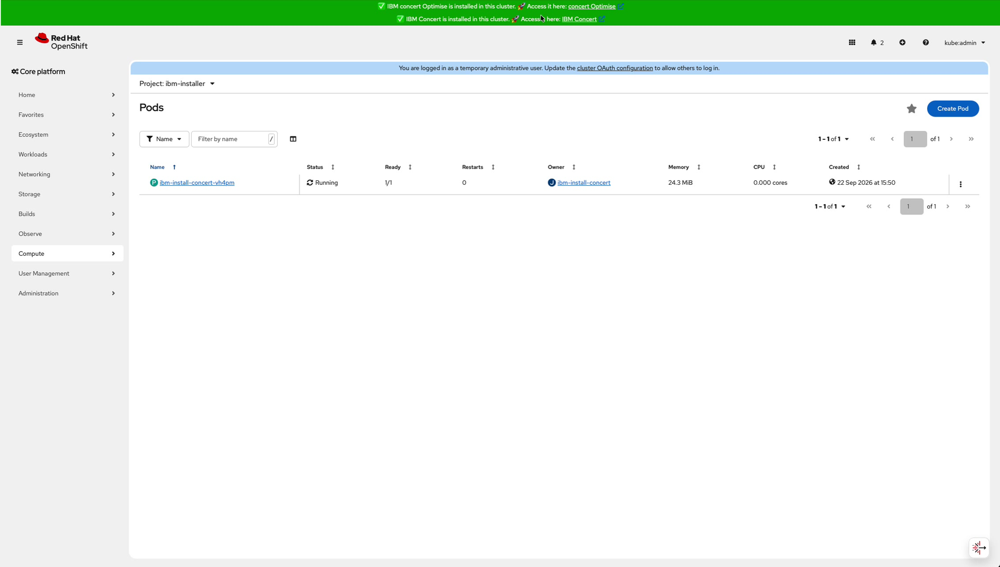

*Figure 1 The installer pod is running and the product installation banners are green. Recording timestamp 00:10*

### Task 2 — Review the installer log safely

The installer log contains the cluster endpoint and credentials needed for Resilience onboarding, but it also contains secrets.

1. Open the installer pod and select Logs.
1. Search for ***CHECK WATSONX CREDENTIALS*** and confirm the log reports that “***You can access the WatsonX services in Concert platform***”.
1. Search for the ***LOGINS FOR RESILIENCE*** section, it contains the cluster logins that you will need later.
1. Download the log only if needed to copy a long endpoint or token. Store it securely and delete the local copy after onboarding.

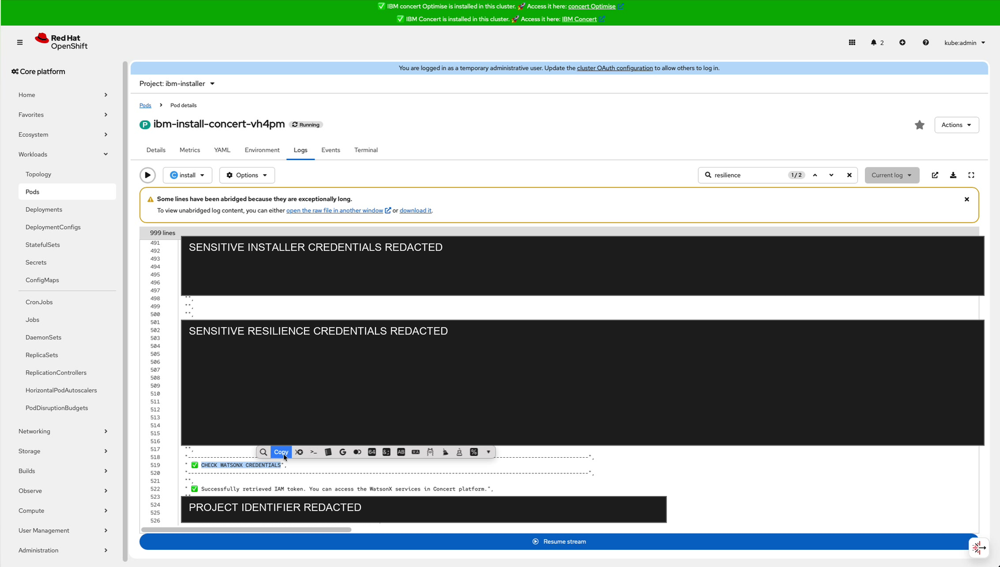

*Figure 2 The installer log contains the Resilience connection details and a successful watsonx credential check. Secrets are redacted here. Recording timestamp 00:45*

### Task 3 — Sign in to IBM Concert

Use the administrative identity configured during installation or the configured external identity provider.

1. Open the IBM Concert URL from the successful installation banner.
1. If Keycloak (default) is not configured, sign in with the administrator account and the password provided in the installation configuration.
1. Do not copy credentials from screenshots or logs into this guide.

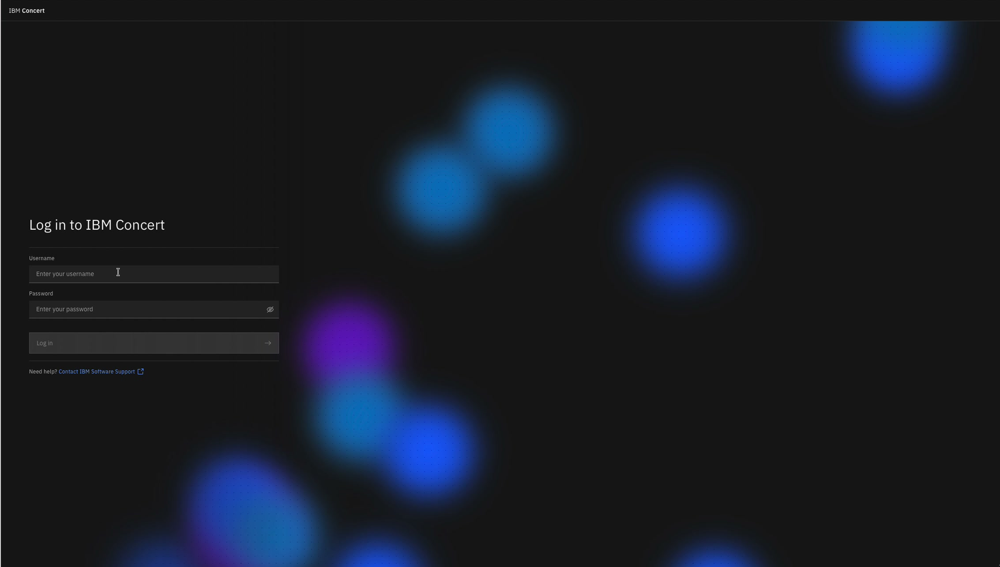

*Figure 3 IBM Concert sign-in page. Recording timestamp 01:25*

## Initial IBM Concert Settings

Apply the minimum settings required for meaningful Resilience and Protect results.

### Task 4 — Enable the required AI agents

Resilience agent functionality is not enabled by default in the demonstrated installation.

1. Open Resilience.
1. Open the administration menu in the left navigation and select Settings.
1. Select AI agents.
1. Enable Resilience Agents and Enable Compliance Agents.
1. Review generated recommendations before acting on them.

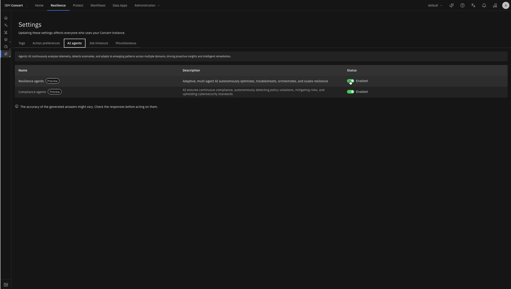

*Figure 4 Resilience Settings shows the Resilience and Compliance agents enabled. Recording timestamp 01:50*

### Task 5 — Enable Protect scoring and lookup

Protect has a separate Settings area from Resilience.

1. Open Protect and select Settings from the left navigation.
1. Select Vulnerability, then Compute.
1. Enable Vulnerability Lookup, Vulnerability Scoring, and Risk Scoring.
1. Confirm the changes apply to the full Concert instance before leaving the page.

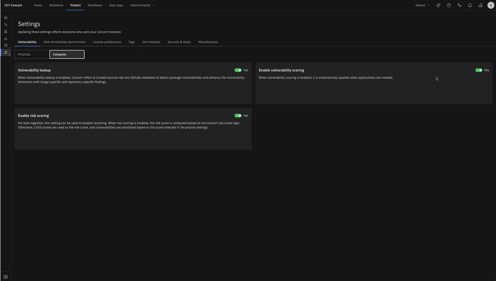

*Figure 5 Protect vulnerability compute settings are enabled. Recording timestamp 02:05*

### Task 6 — Set license preferences

License policy determines which detected package licenses are reported as denied.

1. In Protect Settings, select License preferences.
1. Mark licenses Allowed or Denied according to organizational policy.
1. The recording denies ***BSD 2-Clause*** Simplified and ***BSD 3-Clause*** New or Revised to create visible demonstration findings. Do not copy this example without policy approval.

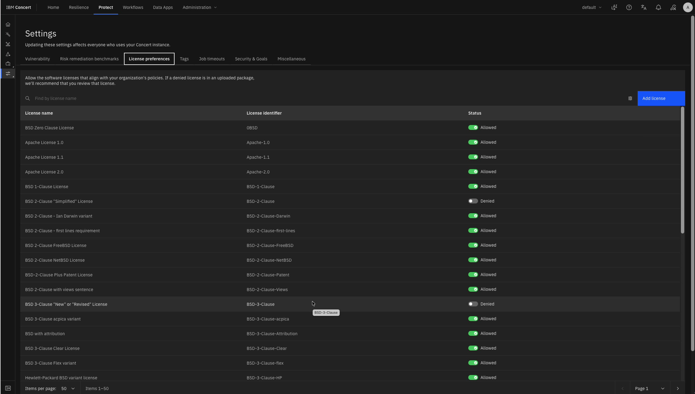

*Figure 6 Example license preferences with two BSD license types denied for demonstration purposes. Recording timestamp 02:20*

### Task 7 — Load sample data

Sample data is useful for demonstrations and training.

1. In Protect Settings, open Miscellaneous.
1. Select Load sample data and confirm the action.
1. Keep the browser open while data loads. The process can take several minutes.

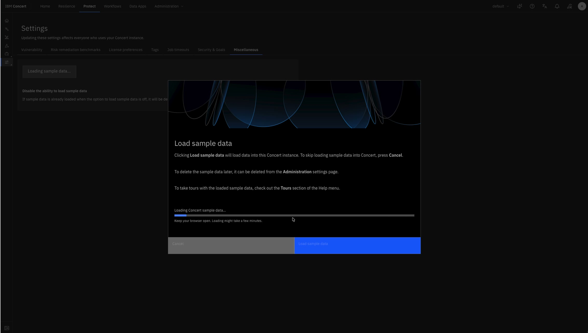

*Figure 7 Protect Miscellaneous settings provides the Load sample data action. Recording timestamp 02:35*

## Resilience Cluster Onboarding

Connect the OpenShift cluster, select the application namespace, and create the initial Resilience assessment.

### Task 8 — Start OpenShift discovery

Create a Resilience integration for the cluster that hosts the target application.

1. Open Resilience and select Discover your data.
1. Select Red Hat OpenShift Container Platform OCP.
1. Choose Create new connection.
1. Enter the cluster API endpoint exactly as shown in the installer log (***LOGINS FOR RESILIENCE***), including its port.
1. Enter the Resilience API token from the installer log (***LOGINS FOR RESILIENCE***).

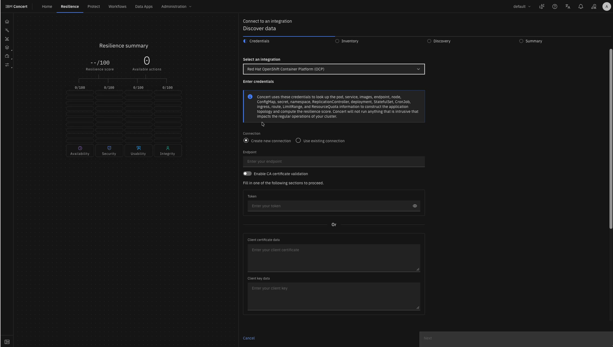

*Figure 8 The Resilience discovery wizard starts with an OpenShift connection. Recording timestamp 02:55*

### Task 9 — Validate the cluster connection

Validation must succeed before inventory selection becomes available.

1. Enter a stable cluster name such as ***local*** for a local demonstration cluster.
1. Select Validate connection and wait for a successful status.
1. If validation fails, recheck the full endpoint, token, network reachability, and certificate settings before retrying.

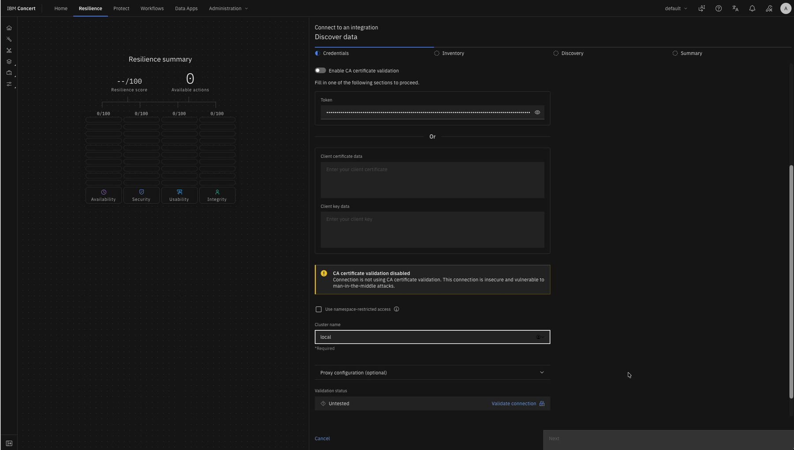

*Figure 9 Connection settings immediately before validation; the token is masked. Recording timestamp 04:16*

### Task 10 — Select the inventory and schedule

Limit discovery to the namespaces and assessment cadence that are in scope.

1. Accept or rename the discovery job.
1. Type in the target environment, for example ***Production***.
1. Set the aggregation or assessment period. The recording uses a 24-hour schedule.
1. Open Select namespaces, filter for ***robot-shop***, select it, and save the selection.

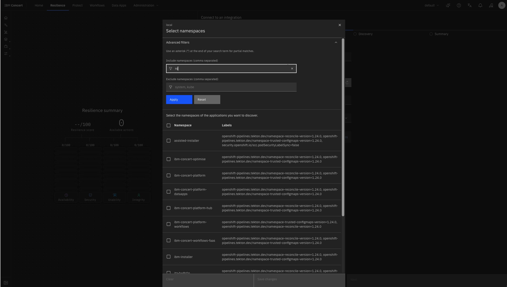

*Figure 10 Namespace selection filters the cluster inventory before discovery. Recording timestamp 04:48*

### Task 11 — Set application and deployment details

Clean application metadata prevents confusing names in later dashboards and reports.

1. Create a new application.
1. Set the application name to ***robot-shop*** and use the deployed version, shown as 1.0.0 in the recording.
1. Replace the generated deployment name with a meaningful name such as ***robot-shop_1.0.0_Production*** production when appropriate.
1. Select the ***Kubernetes*** Resilience profile and save.

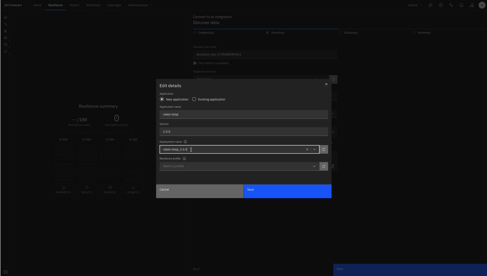

*Figure 11 Application metadata is reviewed before saving the discovery configuration. Recording timestamp 05:15*

### Task 12 — Verify Resilience results

Allow discovery and assessment to complete before continuing.

1. Open Resilience and review Postures.
1. Confirm a row exists for the expected application, environment, and Kubernetes profile.
1. Confirm an assessment is present and a latest score is displayed.
1. The recording shows robot-shop in Production with a score near 54; your score will reflect your environment.

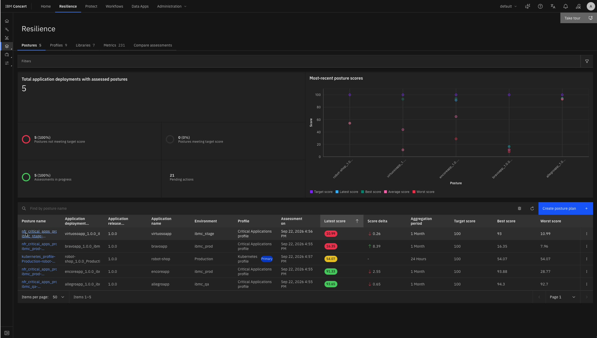

*Figure 12 Resilience Postures includes the robot-shop Production deployment and its latest assessment score. Recording timestamp 05:50*

## Protect Codebase Onboarding

Connect source repositories so Protect can calculate CVE, exposure, SAST, and package risk.

### Task 13 — Connect a GitHub repository

The sample data does not contain a codebase, so a real or demonstration repository must be connected separately.

1. You might want to fork some repositories to your own workspace (otherwise <u>you won’t be able to proceed</u>):

   - https://github.com/niklaushirt/robot-shop

   - https://github.com/niklaushirt/galaxium-travels

1. Open Protect and select Discover your data.

1. Provide the GitHub repository URL, for example the ***robot-shop*** repository used in the recording.

1. When prompted, provide a **classic GitHub personal access token** with the minimum required repository permissions.

1. Wait while the connection is validated. If the first attempt times out, verify permissions and retry rather than creating multiple credentials immediately.

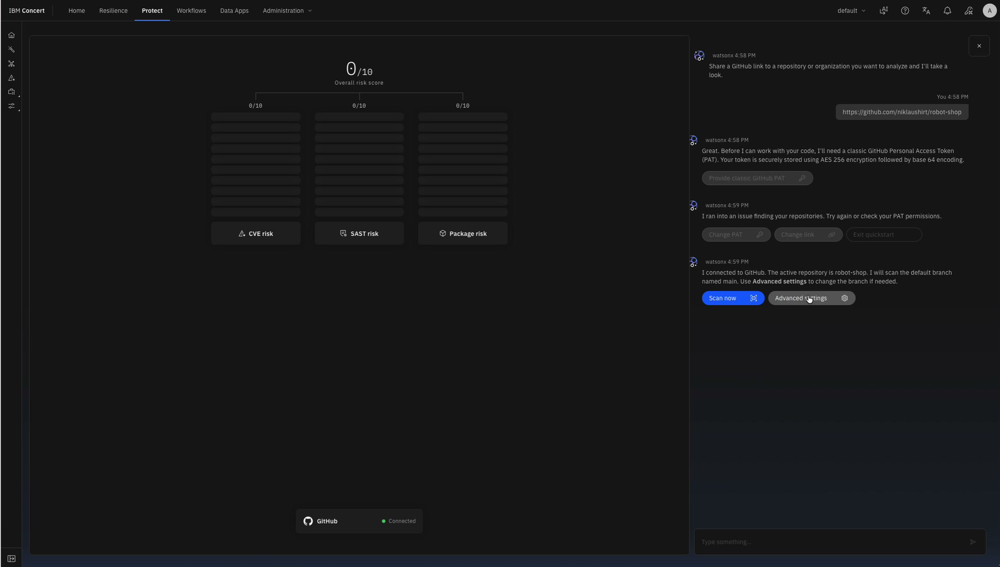

*Figure 13 The Protect quickstart confirms the GitHub connection after an initial failed attempt. Recording timestamp 07:32*

### Task 14 — Map and scan the repository

Associate the repository with the correct application before starting the scan.

1. Open Advanced settings.
1. Use the existing ***robot-shop*** application that already exists from Resilience onboarding.
1. Set the application version to 1.0.0 and verify the repository and branch.
1. Save and start the scan.
1. Wait for CVE, SAST, and package data to finish ingesting.

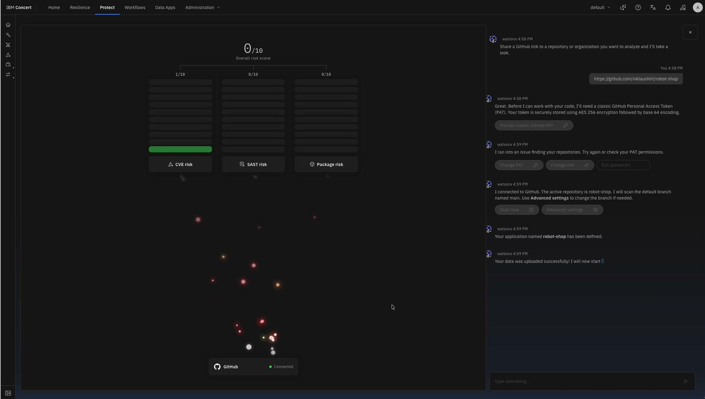

*Figure 14 Protect begins processing the connected robot-shop repository. Recording timestamp 07:50*

### Task 15 — Verify risk and codebase results

Protect may populate risk categories at different times while data is processed.

1. Refresh the Protect dashboard after the scan completes.
1. Confirm a codebase appears and that the overall risk score is no longer empty.
1. Confirm CVE, prioritized exposure, and package-risk counts are present where applicable.
1. Allow additional processing time if some cards remain empty immediately after onboarding.

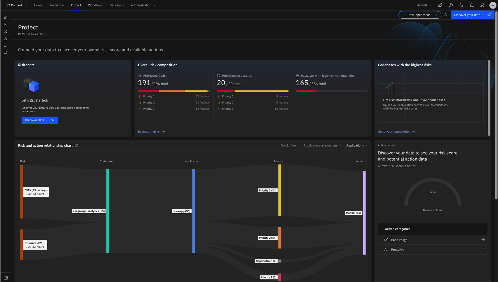

*Figure 15 Protect shows risk counts and begins associating them with the newly connected codebase. Recording timestamp 08:10*

### Task 16 — Onboard another application with saved credentials

A validated GitHub credential can be reused for other repositories that it is authorized to read.

1. Start Discover your data again and provide the next repository URL (***galaxium-travels*** for example).
1. Select the existing GitHub credential rather than entering the token again.
1. Choose Create new application, set a recognizable name such as ***galaxium-travels***, and set its version.
1. Verify the repository and branch, then save and scan.

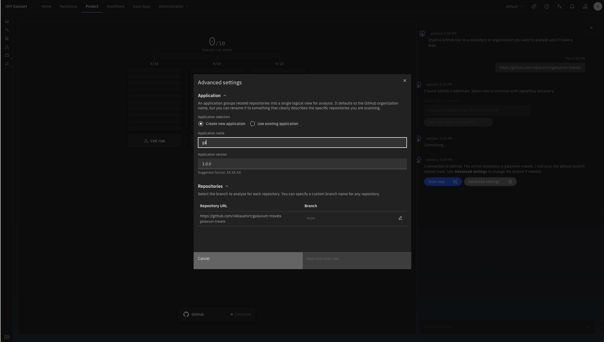

*Figure 16 Advanced settings creates a new application while reusing the connected GitHub credential. Recording timestamp 08:55*

### Task 17 — Confirm applications appear in Protect

Dashboard data can lag behind repository ingestion.

1. Return to the Protect dashboard after each scan is submitted.
1. Confirm both application codebases appear in the high-risk codebase visualization when processing completes.
1. Confirm actions are generated and review them from the relevant view.

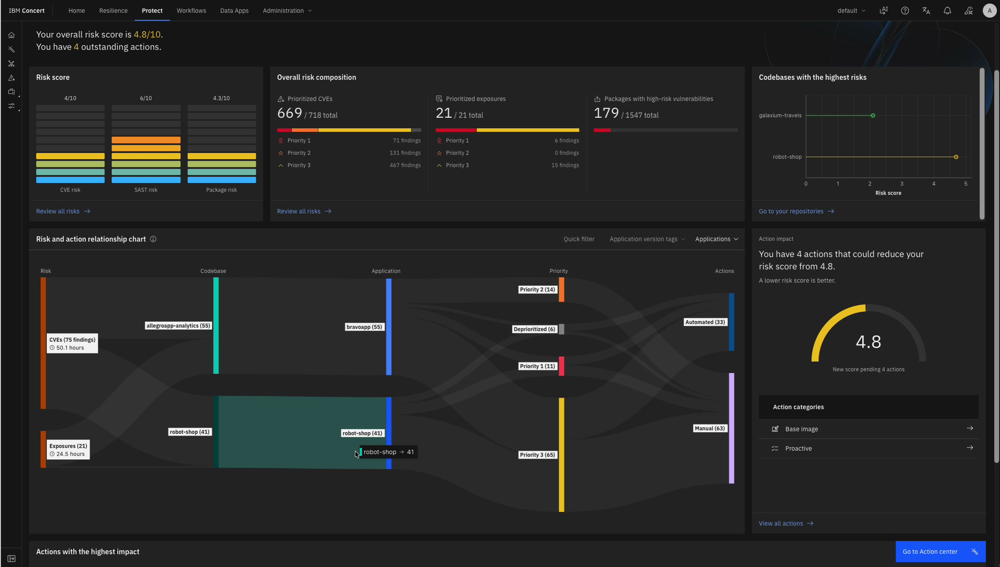

*Figure 17 Protect displays both robot-shop and galaxium-travels in the high-risk codebase view. Recording timestamp 09:40*

## Compliance Discovery

Reuse the OpenShift connection to assess the target namespace against a compliance profile.

### Task 18 — Start a Compliance discovery

Compliance discovery is accessed from the Protect Enterprise view in the recorded interface.

1. Open Protect and switch to Enterprise view.
1. Click Compliance in the ring and select Connect to discover.
1. Select Red Hat OpenShift Container Platform OCP.
1. Choose Use existing connection and select the cluster connection created for Resilience.

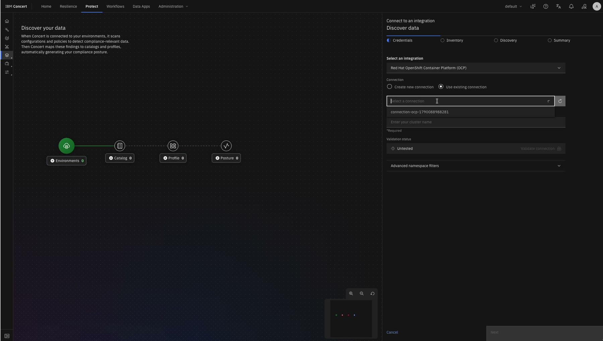

*Figure 18 Compliance discovery reuses the existing OpenShift connection. Recording timestamp 10:00*

### Task 19 — Choose the profile and environment

Define the namespace and display name that will appear in compliance results.

1. Select the Kubernetes compliance profile.
1. Select the ***robot-shop*** namespace.
1. *If the interface shortcut captures the hyphen as a browser zoom command, paste the complete namespace from outside instead of typing it.*
1. Set the environment name, for example ***robot-shop***, and review the summary.

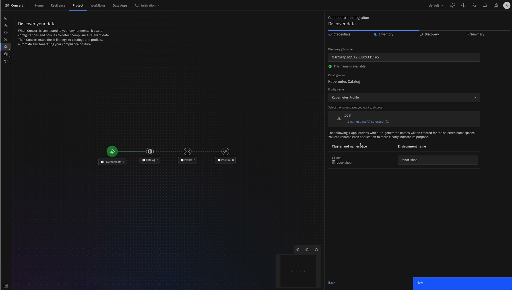

*Figure 19 Compliance discovery uses the Kubernetes profile, selected namespace, and robot-shop environment name. Recording timestamp 10:45*

### Task 20 — Wait for the compliance scan

Inventory discovery can continue even if the dialog is closed.

1. Start discovery and allow the OpenShift inventory scan to complete.
1. The recording estimates about ten minutes for discovery; actual duration depends on the environment.
1. Do not start duplicate scans while the current scan is still active.

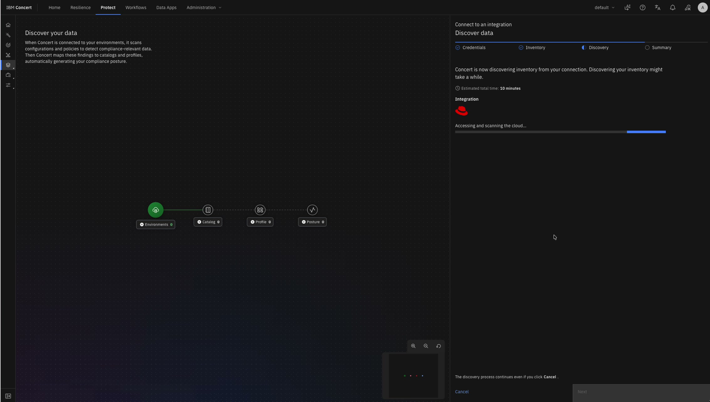

*Figure 20 The compliance discovery process scans OpenShift inventory. Recording timestamp 10:55*

### Task 21 — Review compliance results

Use the results to identify low-compliance postures and recommended actions.

1. Open the Compliance dashboard after discovery completes.
1. Review assessed controls, profiles, posture distribution, open tickets, and assessment history.
1. Open recommended actions for non-compliant findings.
1. Generate action plans only when the configured AI service is available, and review the generated plan before execution.

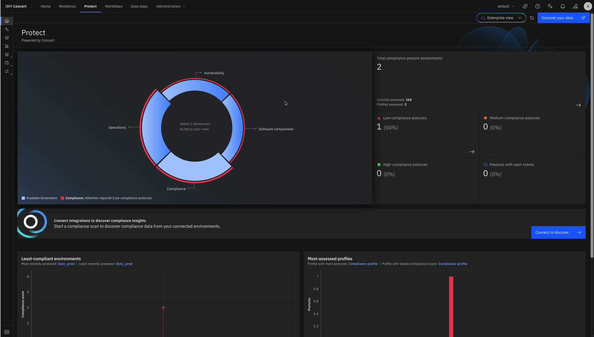

*Figure 21 The Compliance dashboard reports posture assessments and highlights attention required. Recording timestamp 11:40*

## Secure Coder Integration

Create and protect the IBM Concert API credential needed by Secure Coder.

### Task 22 — Generate the API key

Generate a dedicated API key only when Secure Coder or another approved integration requires it.

1. Open Protect in Developer focus and open the API key action in the top navigation.
1. Select Generate API key.
1. Copy the API key immediately to the approved secret store. It is unique and non-recoverable.
1. Copy the IBM Concert base URL from the browser or the displayed usage example.
1. Use the project identifier required by the target integration. The recording uses the default all-zero identifier; verify the value for your installation before use.
1. Revoke and recreate the key if it is exposed or lost.

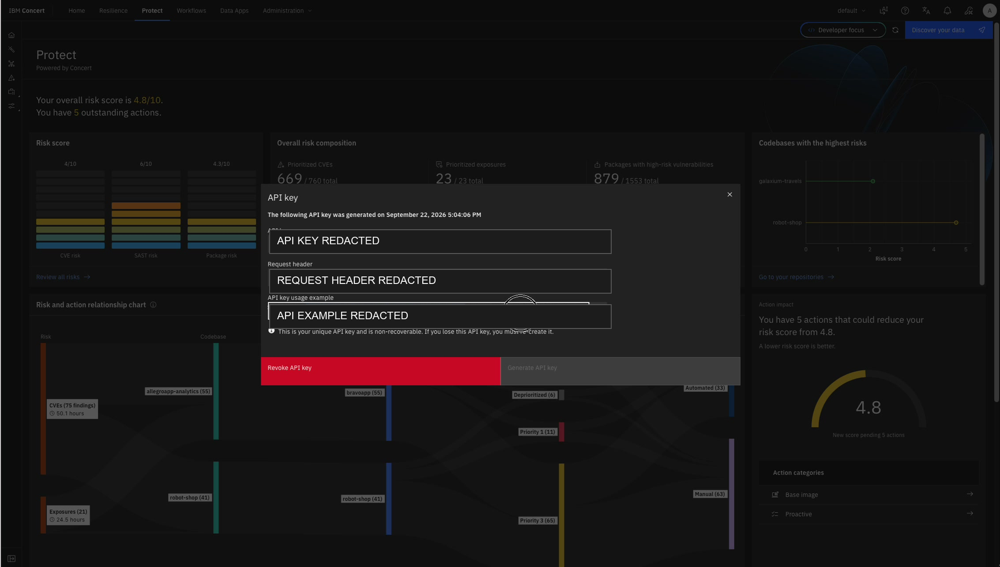

*Figure 22 The generated API key dialog. Secret values and the usage example are redacted. Recording timestamp 12:12*

## Integration with KeyCloak/OpenLDAP (Optional)

If you have enabled KeyCloak (`integrate_keycloak`) and OpenLDAP (`install_ldap`) in the installation configuration, please follow the steps below.

### Task 23 — Connect to KeyCloak

Generate a dedicated API key only when Secure Coder or another approved integration requires it.

1. Click on the banner `✅ IBM Concert KeyCloak. User: xxx - Password: yyyy 🚀 Access it here: IBM KeyCloak`
1. Login with the provided parameters.

>  You can find the KeyCloak Credentials in the Log File. 
>
> Search for `Keycloak Credentials` 

### Task 23 — Integrate with OpenLDAP

Generate a dedicated API key only when Secure Coder or another approved integration requires it.

1. Click on `UserFederation`

1. Add LDAP Provider

1. Fill in the following parameters, don't touch the rest of the fields

   | Field            | Value                                        |
   | ---------------- | -------------------------------------------- |
   | UI display name  | LDAP                                         |
   | Vendor           | Other                                        |
   | Connection URL   | ldap://openldap.openldap:389                 |
   | BindDN           | cn=admin,dc=ibm,dc=com                       |
   | Bind credentials | The Password you have set in the config file |
   | Edit mode        | WRITABLE                                     |
   | Users DN         | ou=People,dc=ibm,dc=com                      |

1. Click save.

1. Click on the newly created connection.

1. Top right: click Action - Sync All Users

1. You should get **Sync of users finished successfully. xx users added,**

### Task 24 — Define Users

Now the users have been imported but cannot access Concert platform yet.

1. Click `Users` (there are no users shown).
1. Search for `*`, you should get a list of predefined users.
1. Select one (for example `demo`).
1. Click `RoleMappling`
1. Click `AssignRole` - `Client Roles`
1. You can assign either `Admin` or `User` role (you probably want Admin for the demo)
1. Click `Assign`
1. Try to login with the user you just updated and the global password you have set in the config file

>  As you have set the Edit Mode to WRITEABLE you can also create users in KeyCloak that will get stored in OpenLDAP. 

>  You can find the OpenLDAP Credentials and the link to the Admin Console in the Log File if needed. 
>
> Search for `LDAP CREDENTIALS` and `openldap_app_route`
>
> The login is:
>
> **Login DN:**    cn=admin,dc=ibm,dc=com
>
> **Password:**  the global password you have set in the config file

## Final Verification Checklist

The post-install work is complete when each applicable item below is confirmed.

- [ ] IBM Concert and IBM Concert Optimize installation banners are green.
- [ ] The installer pod is Running and Ready.
- [ ] The installer log confirms watsonx availability without exposing the raw log.
- [ ] Required Resilience and Compliance agents are enabled.
- [ ] Protect vulnerability lookup, vulnerability scoring, and risk scoring are enabled.
- [ ] License preferences match approved organizational policy.
- [ ] Sample data is loaded only if it is appropriate for the instance.
- [ ] The OpenShift connection validates successfully with certificate validation enabled for production.
- [ ] The intended namespace, environment, application, version, deployment name, and profile are correct.
- [ ] Resilience shows the target deployment and an assessment score.
- [ ] Protect shows each connected codebase and populated risk categories.
- [ ] Compliance shows a completed assessment and recommended actions.
- [ ] The Secure Coder API key is stored in an approved secret store and is not present in tickets, logs, or this document.

## Troubleshooting Notes

### OpenShift or Resilience validation fails

- Copy the full API endpoint including the port; do not rely on a truncated log line.
- Confirm the token is complete and has not gained whitespace during copy and paste.
- Confirm network access from IBM Concert to the OpenShift API and validate the CA chain.

### GitHub validation appears stuck or fails once

- Wait for the validation response before submitting again.
- Confirm the personal access token has access to the repository and branch.
- Retry once with the same verified token; the recording succeeds on a second attempt after a transient failure.

### Dashboards remain partially empty

- Allow ingestion and scoring to finish, then refresh the view.
- Confirm the repository or namespace is associated with the intended application and environment.
- Avoid duplicate scans while the first discovery is still running.
